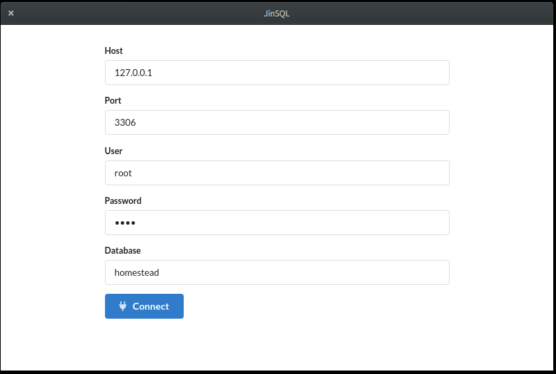
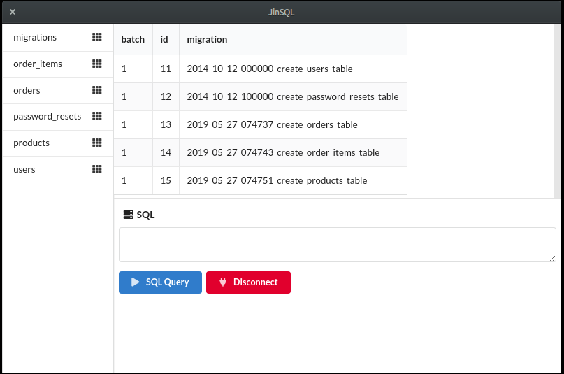
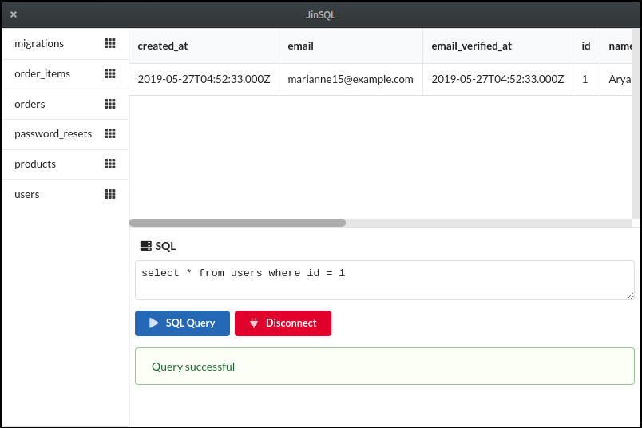

# sql-electron-client

**Clone and run for a quick way to see Electron in action.**

This is a minimal mySQL Client Electron application based on the [Quick Start Guide](https://electronjs.org/docs/tutorial/quick-start) within the Electron documentation.

You can learn more about each of these components within the [Quick Start Guide](https://electronjs.org/docs/tutorial/quick-start).

## To Use

To clone and run this repository you'll need [Git](https://git-scm.com) and [Node.js](https://nodejs.org/en/download/) (which comes with [npm](http://npmjs.com)) installed on your computer. From your command line:

```bash
# Clone this repository
git clone https://github.com/kritish-dhaubanjar/sql-electron-client.git
# Go into the repository
cd sql-electron-client
# Install dependencies
npm install
# Run the app
npm start
```

## Screenshots





Note: If you're using Linux Bash for Windows, [see this guide](https://www.howtogeek.com/261575/how-to-run-graphical-linux-desktop-applications-from-windows-10s-bash-shell/) or use `node` from the command prompt.

## Resources for Learning Electron

- [electronjs.org/docs](https://electronjs.org/docs) - all of Electron's documentation
- [electronjs.org/community#boilerplates](https://electronjs.org/community#boilerplates) - sample starter apps created by the community
- [electron/electron-quick-start](https://github.com/electron/electron-quick-start) - a very basic starter Electron app
- [electron/simple-samples](https://github.com/electron/simple-samples) - small applications with ideas for taking them further
- [electron/electron-api-demos](https://github.com/electron/electron-api-demos) - an Electron app that teaches you how to use Electron
- [hokein/electron-sample-apps](https://github.com/hokein/electron-sample-apps) - small demo apps for the various Electron APIs
